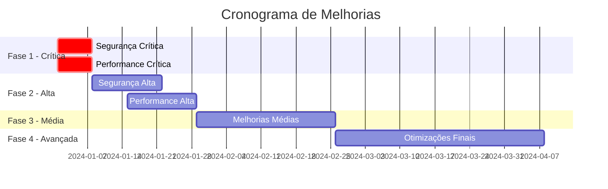

# 🔐 Relatório de Melhorias - Segurança e Performance
## Aplicação Rekovi Web - Análise Completa

---

## 📋 Resumo Executivo

Esta análise identificou **23 oportunidades de melhoria** críticas e importantes distribuídas entre segurança, performance e qualidade do código. As melhorias foram organizadas em 4 fases de implementação para garantir uma aplicação gradual e controlada.

### 🎯 Estatísticas da Análise
- **Vulnerabilidades de Segurança**: 8 itens
- **Problemas de Performance**: 9 itens  
- **Melhorias de Qualidade**: 6 itens
- **Prioridade Crítica**: 6 itens
- **Prioridade Alta**: 10 itens
- **Prioridade Média**: 7 itens

---

## 🚨 FASE 1 - CRÍTICA (Implementar Imediatamente)

### 🔐 SEGURANÇA CRÍTICA

#### 1. **Exposição de Tokens na API Client** ⚠️ CRÍTICO
**Problema**: Token Pipefy exposto em variável pública no código
**Localização**: `components/MobileTaskManager.tsx:1158, 1270, 1352, 1360`
```typescript
// VULNERÁVEL
...(process.env.NEXT_PUBLIC_PIPEFY_TOKEN && { 'Authorization': `Bearer ${process.env.NEXT_PUBLIC_PIPEFY_TOKEN}` })
```
**Solução**:
- Mover token para variável de servidor (`PIPEFY_TOKEN` sem `NEXT_PUBLIC_`)
- Criar API routes para Pipefy operations no backend
- Implementar proxy server-side para chamadas Pipefy

#### 2. **Hardcoded Organization IDs** ⚠️ CRÍTICO
**Problema**: IDs de organização expostos no código client-side
**Localização**: `components/KanbanBoard.tsx:606, 676`
```typescript
// VULNERÁVEL
organizationId: "281428"
const organizationId = "870bddf7-6ce7-4b9d-81d8-9087f1c10ae2"
```
**Solução**:
- Mover IDs para variáveis de ambiente servidor
- Criar endpoint seguro para obter configurações

#### 3. **URL Base Hardcoded para APIs** 🔒 ALTO
**Problema**: URLs de API Pipefy hardcoded no código
**Localização**: `components/MobileTaskManager.tsx:1155, 1267`
```typescript
// VULNERÁVEL
const response = await fetch('https://api.pipefy.com/graphql', {
```
**Solução**:
- Centralizar URLs em arquivo de configuração
- Usar proxy interno para APIs externas

### ⚡ PERFORMANCE CRÍTICA

#### 4. **Queries Excessivamente Amplas** ⚠️ CRÍTICO
**Problema**: Queries buscam 100.000 registros sem otimização
**Localização**: `components/KanbanBoard.tsx:52`, `components/MobileTaskManager.tsx:53`
```typescript
// PROBLEMÁTICO
.limit(100000)
```
**Solução**:
- Implementar paginação server-side
- Usar `limit(50)` com load more
- Implementar cache com invalidação inteligente

#### 5. **Real-time Updates Ineficientes** ⚠️ CRÍTICO
**Problema**: Refetch completo a cada mudança + polling agressivo
**Localização**: `components/KanbanBoard.tsx:164`, `components/MobileTaskManager.tsx:158`
```typescript
// PROBLEMÁTICO
const intervalId = setInterval(fetchUpdatedData, 10000) // A cada 10s!
```
**Solução**:
- Implementar updates incrementais
- Reduzir polling para 30-60 segundos
- Usar Supabase real-time apenas para mudanças específicas

#### 6. **Ausência de Memoização Crítica** ⚡ ALTO
**Problema**: Re-renderizações desnecessárias em componentes pesados
**Localização**: `components/KanbanBoard.tsx`, `components/MobileTaskManager.tsx`
**Solução**:
- Implementar `React.memo()` nos componentes Card
- Usar `useCallback()` para event handlers
- Implementar `useMemo()` para cálculos pesados

---

## 🔧 FASE 2 - ALTA PRIORIDADE (2-4 semanas)

### 🔐 SEGURANÇA ALTA

#### 7. **Upgrade Node.js para v20+** 🔧 ALTO
**Problema**: Node.js 18 está deprecado pelo Supabase
**Localização**: `package.json:24`, ambiente de deploy
```json
// ATUAL
"engines": {
  "node": ">=18.0.0"
}
```
**Solução**:
- Atualizar para Node.js 20+ (LTS atual)
- Verificar compatibilidade Vercel
- Atualizar workflows GitHub Actions se houver
- **Impacto**: Zero breaking changes esperados
- **Urgência**: Supabase descontinuará suporte para Node 18

#### 8. **Validação de Input Insuficiente** 🔒 ALTO
**Problema**: Falta sanitização em GraphQL queries
**Localização**: `components/KanbanBoard.tsx:283-304`
```typescript
// VULNERÁVEL A INJECTION
nodeId: "${cardId}"
text: "O ${userEmail} alocou o chofer para recolha."
```
**Solução**:
- Implementar escape de caracteres especiais
- Usar prepared statements/parametrized queries
- Validar todos os inputs do usuário

#### 8. **Rate Limiting Inconsistente** 🔒 ALTO
**Problema**: Rate limiting apenas no middleware, não nas APIs
**Localização**: `middleware.ts:44-84`
**Solução**:
- Implementar rate limiting em todas as API routes
- Usar Redis para armazenamento distribuído
- Implementar diferentes limites por tipo de operação

#### 9. **Headers de Segurança Inconsistentes** 🔒 ALTO
**Problema**: Headers diferentes entre `next.config.ts` e `vercel.json`
**Localização**: `next.config.ts:20-56`, `vercel.json:12-30`
**Solução**:
- Consolidar headers em um local
- Adicionar headers faltantes (HSTS, CSP mais restritivo)
- Implementar Content Security Policy completo

### ⚡ PERFORMANCE ALTA

#### 10. **Bundle Size Não Otimizado** ⚡ ALTO
**Problema**: Dependências não otimizadas
**Localização**: `package.json:17-22`
**Solução**:
- Implementar code splitting por rota
- Lazy loading de componentes pesados
- Tree shaking manual das dependências

#### 11. **Imagens Não Otimizadas** ⚡ ALTO
**Problema**: Imagens sem otimização automática
**Localização**: `public/images/`
**Solução**:
- Converter para WebP/AVIF
- Implementar responsive images
- Usar Next.js Image component

#### 12. **Cache Strategy Ausente** ⚡ ALTO
**Problema**: Nenhuma estratégia de cache implementada
**Solução**:
- Implementar SWR ou React Query
- Cache de dados Supabase
- Service Worker para cache offline

---

## 🚀 FASE 3 - MÉDIA PRIORIDADE (1-2 meses)

### 🔐 SEGURANÇA MÉDIA

#### 13. **Logs de Produção Expostos** 🔒 MÉDIO
**Problema**: Logger pode expor dados sensíveis em produção
**Localização**: `utils/logger.ts`
**Solução**:
- Implementar níveis de log por ambiente
- Sanitizar dados pessoais dos logs
- Implementar log rotation

#### 14. **Session Management Melhorias** 🔒 MÉDIO
**Problema**: Validação de sessão pode ser otimizada
**Localização**: `utils/session-validator.ts`, `middleware.ts:21-27`
**Solução**:
- Implementar session refresh automático
- Melhorar detecção de sessão expirada
- Implementar logout automático

### ⚡ PERFORMANCE MÉDIA

#### 15. **Component Re-renders Excessivos** ⚡ MÉDIO
**Problema**: State updates causam re-renders desnecessários
**Localização**: `components/KanbanBoard.tsx:21-35`
**Solução**:
- Implementar state normalization
- Usar context API para estado global
- Otimizar useState dependencies

#### 16. **DOM Manipulation Pesada** ⚡ MÉDIO
**Problema**: Scroll position management manual
**Localização**: `components/KanbanBoard.tsx:113-132`
**Solução**:
- Usar refs para elementos específicos
- Implementar virtualization para listas longas
- Debounce scroll events

#### 17. **Network Requests Não Otimizadas** ⚡ MÉDIO
**Problema**: Múltiplas requests simultâneas sem batching
**Localização**: Vários componentes
**Solução**:
- Implementar request batching
- Usar HTTP/2 multiplexing
- Implementar retry logic com backoff

---

## 🌟 FASE 4 - OTIMIZAÇÕES AVANÇADAS (2-3 meses)

### 🔧 QUALIDADE DE CÓDIGO

#### 18. **TypeScript Strictness** 📝 MÉDIO
**Problema**: `strict: false` no tsconfig
**Localização**: `tsconfig.json:7`
**Solução**:
- Habilitar strict mode gradualmente
- Corrigir tipos implícitos
- Implementar interfaces completas

#### 19. **Error Handling Inconsistente** 📝 MÉDIO
**Problema**: Tratamento de erro inconsistente
**Localização**: Vários componentes
**Solução**:
- Implementar Error Boundaries
- Centralizar error handling
- Implementar error reporting

#### 20. **Code Duplication** 📝 MÉDIO
**Problema**: Código duplicado entre Desktop/Mobile
**Localização**: `components/KanbanBoard.tsx`, `components/MobileTaskManager.tsx`
**Solução**:
- Extrair hooks customizados
- Criar utilities compartilhadas
- Implementar componentes abstratos

### ⚡ PERFORMANCE AVANÇADA

#### 21. **Server-Side Optimizations** ⚡ MÉDIO
**Problema**: SSR não otimizado
**Localização**: `app/layout.tsx:6-7`
**Solução**:
- Implementar ISR para dados estáticos
- Otimizar hydration
- Implementar streaming SSR

#### 22. **Database Query Optimization** ⚡ MÉDIO
**Problema**: Queries Supabase não otimizadas
**Solução**:
- Implementar índices adequados
- Usar RLS (Row Level Security)
- Otimizar joins da view

#### 23. **Progressive Web App** 🌟 BAIXO
**Problema**: Falta PWA capabilities
**Solução**:
- Implementar Service Worker
- Adicionar Web App Manifest
- Implementar offline capabilities

---

## 📊 Métricas de Sucesso

### Segurança
- [ ] Zero vulnerabilidades críticas
- [ ] Implementação de HTTPS/HSTS
- [ ] Rate limiting efetivo
- [ ] Logs sanitizados

### Performance
- [ ] Lighthouse Score > 90
- [ ] First Contentful Paint < 1.5s
- [ ] Time to Interactive < 3s
- [ ] Bundle size < 500KB

### Qualidade
- [ ] TypeScript strict mode
- [ ] Test coverage > 80%
- [ ] Zero linting errors
- [ ] Documentação completa

---

## 🛠 Ferramentas Recomendadas

### Segurança
- **SAST**: SonarQube, Snyk
- **Dependency Scanning**: npm audit, Dependabot
- **Runtime Protection**: Helmet.js

### Performance
- **Monitoring**: New Relic, Vercel Analytics
- **Bundle Analysis**: @next/bundle-analyzer
- **Performance Testing**: Lighthouse CI

### Qualidade
- **Testing**: Jest, React Testing Library
- **E2E**: Playwright
- **Code Quality**: ESLint, Prettier, Husky

---

## 📈 Cronograma de Implementação



---

## 🎯 Conclusão

A implementação dessas melhorias resultará em:

1. **Aplicação mais segura** com proteção adequada contra vulnerabilidades
2. **Performance significativamente melhor** com tempos de carregamento reduzidos
3. **Código mais maintível** e escalável
4. **Experiência do usuário superior** em todos os dispositivos

**Recomendação**: Priorizar a **Fase 1** imediatamente devido aos riscos de segurança críticos identificados.

---

*Relatório gerado em: {{data_atual}}*
*Revisão recomendada: Trimestral*
